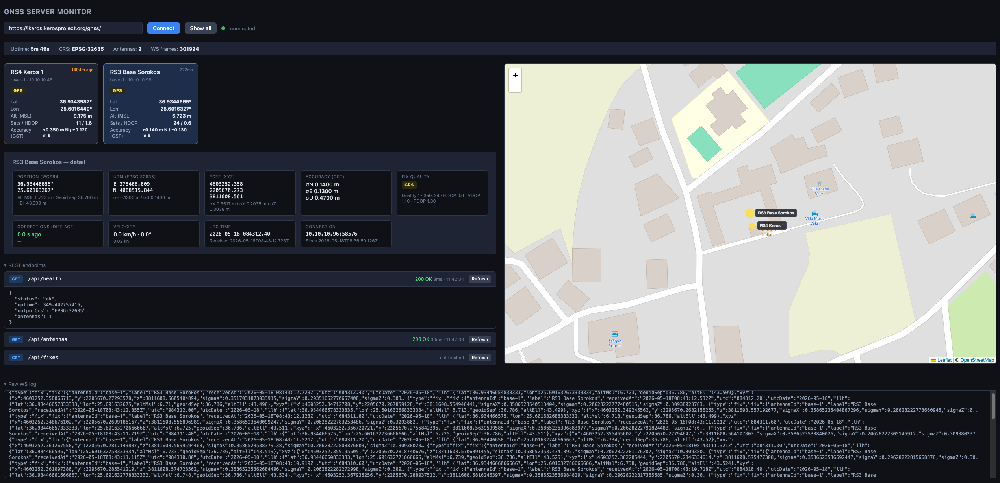

# gnss-server

Ingest NMEA from multiple GNSS antennas over TCP and stream normalized fixes
(LLH + ECEF/XYZ + UTM + accuracy + RTK status) to a React SPA via **WebSocket**
and a small **REST** API. Designed to run as a Docker container on a Linux
x86-64 server or a Raspberry Pi (ARM64).

> Status: **production** — all four implementation phases are complete.
> The service boots end-to-end (TCP listener, REST, WebSocket), parses
> GGA / GST / GSA / RMC / VTG, projects positions to the configured CRS
> (default **EPSG:32635 — WGS84 / UTM zone 35N**), and ships with a
> dark-theme browser monitor at `GET /` (see [screenshot below](#browser-monitor)).
> See [docs/PLAN.md](docs/PLAN.md) and [docs/TODO.md](docs/TODO.md).

---

## Browser monitor

Opening `http://<host>:9200/` serves a built-in dark-theme monitor. It
connects over WebSocket, shows a live Leaflet map with colour-coded markers
per antenna, an antenna card grid, a detail pane with full fix metadata, and
an expandable REST explorer.



Marker colours indicate fix quality: green = RTK\_FIXED, blue = RTK\_FLOAT,
light green = DGPS, yellow = GPS, orange = estimated. A dashed circle shows
the 1-sigma horizontal accuracy when the receiver sends GST sentences.

---

## Quick start (local dev)

```bash
npm install
cp .env.example .env
make dev          # tsx watch — reloads on save
```

In another terminal, replay sample NMEA at the listener:

```bash
make replay                    # localhost:9100, 1 Hz, built-in sample
# or replay a real log:
npm run replay -- 127.0.0.1 9100 path/to/log.nmea 5
```

Run unit tests:

```bash
make test
```

Verify:

```bash
curl http://localhost:9200/api/health
curl http://localhost:9200/api/fixes
```

Open `http://localhost:9200/` in a browser to see the live monitor (antenna
cards, Leaflet map, detail pane, REST explorer).

---

## Quick start (Docker — target deployment)

The service is **not** meant to run permanently on your dev laptop. To deploy
on the Linux server / Raspberry Pi:

```bash
cp .env.example .env
# edit .env if needed (ports, OUTPUT_CRS, LOG_LEVEL)
make prod         # build + start with production overlay
make logs         # tail logs
make ps           # check status
```

Subsequent deploys (pull latest and restart):

```bash
make pull
```

Other useful targets:

```bash
make stop         # docker compose down
make restart      # restart container without rebuild
make build        # start without the production overlay (no limits)
```

Run `make help` for the full list.

Multi-arch image (build once, push to a registry, pull on the Pi):

```bash
docker buildx build \
  --platform linux/amd64,linux/arm64 \
  -t YOUR_REGISTRY/gnss-server:0.1.0 \
  --push .
```

Default exposed ports:

| Port  | Proto | Purpose                           |
|-------|-------|-----------------------------------|
| 9100  | TCP   | NMEA ingestion (antennas dial in) |
| 9200  | TCP   | REST + WebSocket (HTTP)           |

---

## Configuration

All configuration is via environment variables (see `.env.example`):

| Variable              | Default      | Notes                                                      |
|-----------------------|--------------|------------------------------------------------------------|
| `TCP_PORT`            | `9100`       | NMEA listener port (inside container).                     |
| `HTTP_PORT`           | `9200`       | REST + WS port (inside container).                         |
| `MAX_CONNECTIONS`     | `16`         | Hard cap on concurrent antenna sockets.                    |
| `TCP_IDLE_TIMEOUT_MS` | `30000`      | Close silent TCP connections after this ms.                |
| `ANTENNA_PURGE_MS`    | `900000`     | Remove antennas from memory after this ms of inactivity.   |
| `LOG_LEVEL`           | `info`       | pino level: `fatal`/`error`/`warn`/`info`/`debug`.         |
| `REDACT_IPS`          | _(unset)_    | Set `true` to replace IPs with `[redacted]` in logs.       |
| `OUTPUT_CRS`          | `EPSG:32635` | Target CRS for projected `utm` field on each fix.          |
| `ANTENNAS_FILE`       | _(unset)_    | Path to JSON map of `remoteIp` → `{id,label}`.             |

### Antenna mapping

If `ANTENNAS_FILE` is set, the listener uses the source IP of an incoming
connection to resolve a stable `antennaId`. Otherwise it falls back to
`ip:port`. See `config/antennas.example.json`.

---

## Fix schema (WS push & REST response)

```jsonc
{
  "antennaId": "rover-1",
  "label": "North trench rover",
  "receivedAt": "2026-05-15T12:34:56.210Z",
  "utc": "123456.20",
  "utcDate": "2026-05-15",
  "llh": { "lat": 37.97, "lon": 23.72, "altMsl": 78.4, "geoidSep": 41.2, "altEll": 119.6 },
  "xyz": { "x": 4595280.1, "y": 2039473.7, "z": 3912648.9, "sigmaX": 0.01, "sigmaY": 0.01, "sigmaZ": 0.02 },
  "utm": { "x": 738123.45, "y": 4205678.90, "crs": "EPSG:32635", "sigmaE": 0.01, "sigmaN": 0.01 },
  "accuracy": { "source": "GST", "sigmaLat": 0.012, "sigmaLon": 0.011, "sigmaAlt": 0.025 },
  "fix":  { "quality": 4, "status": "RTK_FIXED", "satellites": 18, "hdop": 0.6, "vdop": 1.1, "pdop": 1.3,
            "diffAge": 1.2, "refStationId": "0001" },
  "velocity": { "courseTrue": 54.7, "speedKnots": 0.1, "speedKmh": 0.2 },
  "conn": { "remoteIp": "192.168.1.42", "remotePort": 50211, "since": "...", "lastByteAt": "..." }
}
```

### GGA fix quality codes

The `fix.quality` integer and `fix.status` string are derived from the GGA sentence. The mapping is
standardised by NMEA 0183 and consistent across Trimble, Leica, Emlid Reach, u-blox, and Septentrio receivers:

| `quality` | `status`       | Meaning                                              |
|-----------|----------------|------------------------------------------------------|
| 0         | `NONE`         | No fix (sentence dropped — not forwarded to clients) |
| 1         | `GPS`          | Autonomous GNSS fix                                  |
| 2         | `DGPS`         | Differential GNSS (SBAS / DGNSS corrections)         |
| 3         | `PPS`          | PPS fix                                              |
| 4         | `RTK_FIXED`    | RTK integer fix — centimetre-level accuracy          |
| 5         | `RTK_FLOAT`    | RTK float fix — decimetre-level accuracy             |
| 6         | `ESTIMATED`    | Dead-reckoning                                       |
| 7         | `MANUAL`       | Manual input                                         |
| 8         | `SIMULATION`   | Simulation mode                                      |

> Both `quality` (raw int) and `status` (named string) are present in every fix so the SPA can handle
> unexpected vendor-specific codes gracefully via the integer.

WebSocket protocol on `/ws`:

- On connect: server sends `{"type":"snapshot","fixes":[Fix,...]}`.
- Per update: server sends `{"type":"fix","fix":Fix}`.

---

## REST endpoints

| Method | Path                          | Returns                                     |
|--------|-------------------------------|---------------------------------------------|
| GET    | `/api/health`                 | uptime, output CRS, connected antenna count |
| GET    | `/api/antennas`               | list of antennas with last-fix metadata     |
| GET    | `/api/antennas/:id/last`      | the last `Fix` for the given antenna        |
| GET    | `/api/fixes`                  | snapshot of all latest fixes                |

---

## Testing

```bash
make test          # vitest unit tests
npm run test:watch # watch mode
```

Manual end-to-end with the running container:

```bash
make prod          # start production stack
make replay        # stream sample NMEA at localhost:9100
curl http://127.0.0.1:9200/api/fixes
# open http://127.0.0.1:9200/ — live monitor with map
```

---

## Project layout

```
src/
  config.ts            env parsing + antennas.json loader
  index.ts             entry & wiring
  nmea/                checksum, parseGGA, parseGST
  geodesy/             wgs84 (ECEF) + proj (proj4 wrapper for OUTPUT_CRS)
  store/               fixStore (in-memory latest-per-antenna)
  tcp/                 TCP listener
  rest/                fastify endpoints
  ws/                  WebSocket hub
test/                  vitest unit tests
scripts/
  replay-nmea.ts       TCP client to replay NMEA into the listener
  test-client.html     minimal browser WS viewer
config/
  antennas.example.json
docs/
  PLAN.md              architecture + phased plan
  TODO.md              live task list
```

---

## License

See `LICENSE`.
